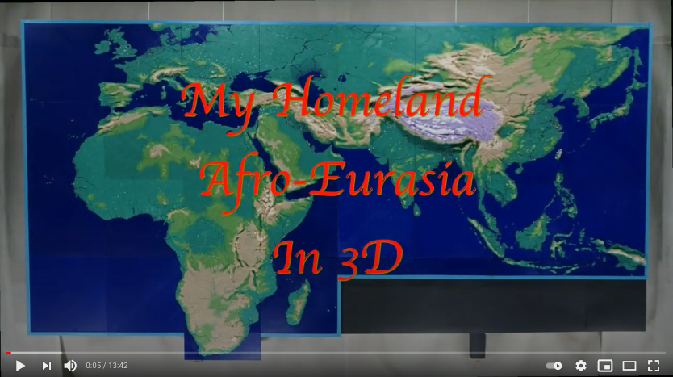

# Annotated Height Map (AHM)

AHM is the acronym for _Annotated Height Map_, an extended data format to the HGT format used by SRTM data and its derivatives.

As a project, AHM stands for two things: that data format, and a complete earth geo-data set. See [THE SITE](https://metaprgmr.github.io/AHM/) for details.

The main content is the AHM Data Set. A compact Java library is also furnished to read AHM data files.

This is the foundation for <i>this work</i>: 

